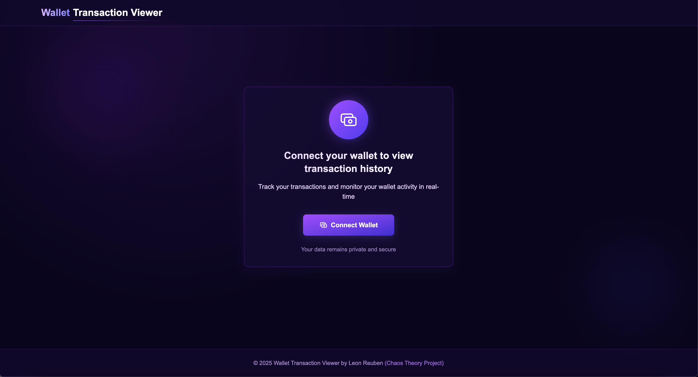
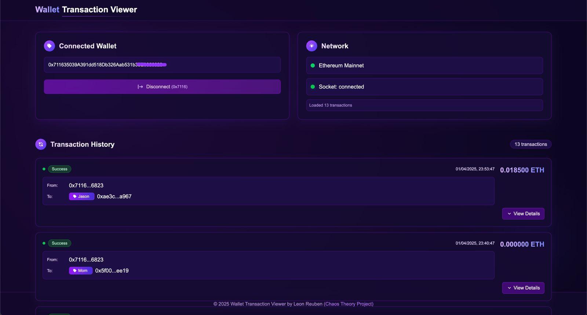

# Wallet Transaction Viewer - Developer Documentation

## Project Overview

The Wallet Transaction Viewer is a real-time Ethereum wallet transaction monitoring application built with Next.js and Socket.io. It allows users to connect their wallets and view transaction history, tag addresses, and store tags in a database. 

## Screenshots

<p align="center">
  
  <br>
  <em>Connect Wallet Interface</em>
</p>

<p align="center">
  
  <br>
  <em>Transaction List View</em>
</p>


## Architecture

### High-Level Architecture

The application follows a client-server architecture with real-time communication:

```
┌─────────────────┐       ┌────────────────┐        ┌────────────────┐
│                 │       │                │        │                │
│  React Frontend │◄──────►  Next.js API   │◄───────►  Socket.io     │
│  (Next.js)      │       │  Routes        │        │  Server        │
│                 │       │                │        │                │
└─────────────────┘       └────────────────┘        └───────┬────────┘
                                                           │
                                                           ▼
                                              ┌─────────────────────────┐
                                              │                         │
                                              │  Blockchain Providers   │
                                              │  - Etherscan API        │
                                              │  - Infura WebSockets    │
                                              │                         │
                                              └─────────────────────────┘
```

### Components

- **Frontend**: React/Next.js application with real-time updates via Socket.io-client
- **Backend**: 
  - Next.js API routes for data fetching
  - Socket.io for real-time communication
- **External Services**:
  - Etherscan API for historical transaction data
  - Infura for WebSocket connections to the Ethereum network
  - Supabase for database storage

## Setup and Installation

### Prerequisites

- Node.js 16+ and pnpm
- Etherscan API key - Get one from [Etherscan API Dashboard](https://etherscan.io/apidashboard)
- Infura API key - Get one from [Infura](https://developer.metamask.io/)
- Supabase account and project - Sign up at [Supabase](https://supabase.com/)

### Installation Steps

1. Clone the repository:
   ```bash
   git clone https://github.com/yourusername/wallet-transaction-viewer.git
   cd wallet-transaction-viewer
   ```

2. Install dependencies:
   ```bash
   pnpm install
   ```

3. Set up environment variables:
   ```bash
   pnpm create-env
   ```
   
   This interactive tool will help you set up the required API keys and configuration.


    Ensure the following environment variables are set in production:

    ```
    ETHERSCAN_API_KEY=your_etherscan_key
    INFURA_API_KEY=your_infura_key
    SUPABASE_URL=your_supabase_url
    SUPABASE_ANON_KEY=your_supabase_anon_key
    NEXT_PUBLIC_APP_URL=your_app_url
```

4. Run SQL to create the tags table on Supabase SQL Editor:
    ```sql
    create table tags (
    wallet_address text not null,
    target_address text not null,
    tag_name text not null,
    created_at timestamp with time zone default now()
    );

    -- Recommended indexes for better query performance
    create index idx_tags_wallet_address on tags(wallet_address);
    create index idx_tags_target_address on tags(target_address);
    ```

    This table stores address tags created by users:
    - `wallet_address`: The Ethereum address of the wallet that created the tag
    - `target_address`: The Ethereum address being tagged/labeled
    - `tag_name`: The custom label assigned to the address
    - `created_at`: Timestamp when the tag was created


5. Start the Socket.io server:
   ```bash
   pnpm socket-server
   ```

6. In a separate terminal, start the Next.js development server:
   ```bash
   pnpm run dev
   ```

7. Open http://localhost:3001 in your browser.

8. VOILA! The Wallet Transaction Viewer is now running.

## Key Features

### 1. Wallet Connection
- Integration with WalletConnect and Web3Modal
- Support for multiple wallet providers (MetaMask, Trust Wallet, etc.)
- Secure connection handling

### 2. Transaction History
- Retrieval of historical transactions from Etherscan
- Formatted transaction display with status indicators
- Pagination and filtering options

### 3. Real-Time Transaction Updates
- WebSocket connection to Ethereum network via Infura
- Polling mechanism for Etherscan updates (added as a fallback)
- Automatic transaction status updates

### 4. Address Tagging
- Custom tagging of Ethereum addresses
- Persistent storage of tags in Supabase
- Shared tags across sessions

